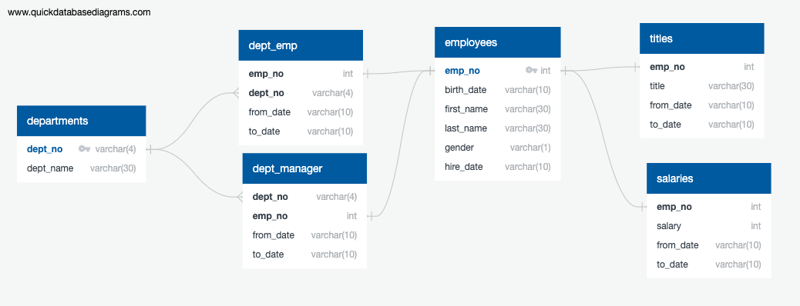
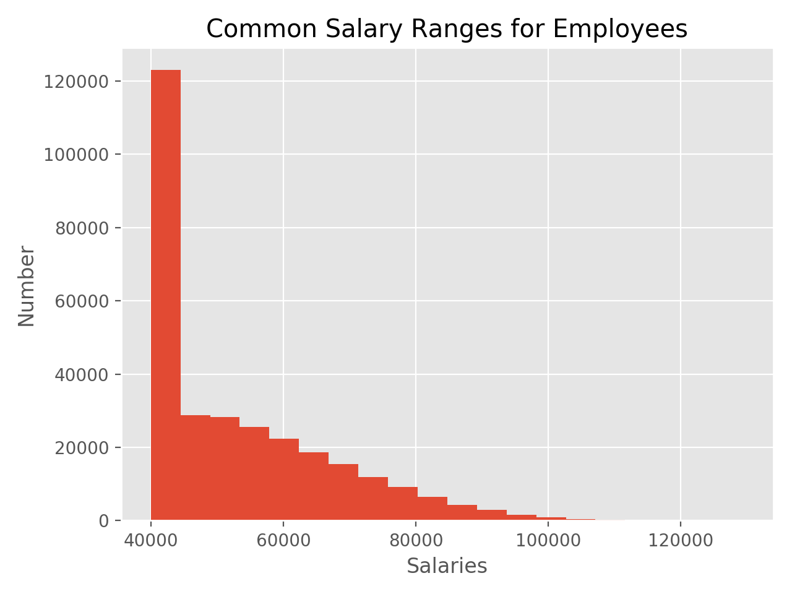

# Background

It is a beautiful spring day, and it is two weeks since you have been hired as a new data engineer at Pewlett Hackard. Your first major task is a research project on employees of the corporation from the 1980s and 1990s. All that remain of the database of employees from that period are six CSV files.

In this assignment, you will design the tables to hold data in the CSVs, import the CSVs into a SQL database, and answer questions about the data. In other words, you will perform:

* Data Modeling
* Data Engineering
* Data Analysis

# Data Modeling

Inspect the CSVs and sketch out an ERD of the tables. Feel free to use a tool like [http://www.quickdatabasediagrams.com](http://www.quickdatabasediagrams.com).



# Data Engineering

* Use the information you have to create a table schema for each of the six CSV files. Remember to specify data types, primary keys, foreign keys, and other constraints.
```sql
CREATE TABLE employees (
    emp_no int NOT NULL,
    birth_date varchar(10) NOT NULL,
    first_name varchar(30) NOT NULL,
    last_name varchar(30) NOT NULL,
    gender varchar(1) NOT NULL,
    hire_date varchar(10) NOT NULL
);
CREATE TABLE departments (
    dept_no varchar(4) NOT NULL,
    dept_name varchar(30) NOT NULL
);
CREATE TABLE dept_emp (
    emp_no int NOT NULL,
    dept_no varchar(4) NOT NULL,
    from_date varchar(10) NOT NULL,
    to_date varchar(10) NOT NULL
);
CREATE TABLE dept_manager (
    dept_no varchar(4) NOT NULL,
    emp_no int NOT NULL,
    from_date varchar(10) NOT NULL,
    to_date varchar(10) NOT NULL
);
CREATE TABLE salaries (
    emp_no int NOT NULL,
    salary int NOT NULL,
    from_date varchar(10) NOT NULL,
    to_date varchar(10) NOT NULL
);
CREATE TABLE titles (
    emp_no int NOT NULL,
    title varchar(30) NOT NULL,
    from_date varchar(10) NOT NULL,
    to_date varchar(10) NOT NULL
);
```

* Import each CSV file into the corresponding SQL table.

# Data Analysis

Once you have a complete database, do the following:

1. List the following details of each employee: employee number, last name, first name, gender, and salary.
```sql
select employees.emp_no, last_name, first_name, gender, salary
from employees
inner join salaries
on employees.emp_no = salaries.emp_no;
```

2. List employees who were hired in 1986.
```sql
select last_name, first_name, hire_date
from employees
where hire_date like '1986%';
```

3. List the manager of each department with the following information: department number, department name, the manager's employee number, last name, first name, and start and end employment dates.
```sql
create view manager_list as
select dept_manager.dept_no, dept_name, dept_manager.emp_no, from_date, to_date
from dept_manager
inner join departments
on dept_manager.dept_no = departments.dept_no;
select manager_list.dept_no, dept_name, manager_list.emp_no, last_name, first_name, from_date, to_date
from manager_list
inner join employees
on manager_list.emp_no = employees.emp_no
-- Uncomment next line to get current manager in each department.
-- where to_date like '9999%';
```

4. List the department of each employee with the following information: employee number, last name, first name, and department name.
```sql
create view employee_list as
select employees.emp_no, last_name, first_name, dept_no
from employees
inner join dept_emp
on employees.emp_no = dept_emp.emp_no;
select emp_no, last_name, first_name, dept_name
from employee_list
inner join departments
on employee_list.dept_no = departments.dept_no;
```

5. List all employees whose first name is "Hercules" and last names begin with "B."
```sql
select *
from employees
where first_name = 'Hercules'
and last_name like 'B%';
```

6. List all employees in the Sales department, including their employee number, last name, first name, and department name.
```sql
create view sales_employees as
select emp_no, last_name, first_name
from employees
where emp_no in (
	select emp_no
	from dept_emp as d
	where dept_no in (
		select dept_no
		from departments
		where dept_name = 'Sales'
	)
);
select s.emp_no, last_name, first_name, dept_name
from sales_employees as s
join dept_emp as d
on s.emp_no = d.emp_no
join departments
on d.dept_no = departments.dept_no
where dept_name = 'Sales';
```

7. List all employees in the Sales and Development departments, including their employee number, last name, first name, and department name.
```sql
create view sales_develop as
select emp_no, last_name, first_name
from employees
where emp_no in (
	select emp_no
	from dept_emp as d
	where dept_no in (
		select dept_no
		from departments
		where dept_name = 'Sales'
		or dept_name = 'Development'
	)
);
select s.emp_no, last_name, first_name, dept_name
from sales_develop as s
join dept_emp as d
on s.emp_no = d.emp_no
join departments
on d.dept_no = departments.dept_no
where dept_name = 'Sales'
or dept_name = 'Development';
```

8. In descending order, list the frequency count of employee last names, i.e., how many employees share each last name.
```sql
select last_name, count(last_name) as "Frequency Count"
from employees
group by last_name
order by "Frequency Count" desc;
```

# SQLAlchemy
As you examine the data, you are overcome with a creeping suspicion that the dataset is fake. You surmise that your boss handed you spurious data in order to test the data engineering skills of a new employee. To confirm your hunch, you decide to take the following steps to generate a visualization of the data, with which you will confront your boss:
1. Import the SQL database into Pandas. (Yes, you could read the CSVs directly in Pandas, but you are, after all, trying to prove your technical mettle.) This step may require some research. Feel free to use the code below to get started. Be sure to make any necessary modifications for your username, password, host, port, and database name:

   ```sql
   from sqlalchemy import create_engine
   engine = create_engine('postgresql://localhost:5432/<your_db_name>')
   connection = engine.connect()
   ```

* Consult [SQLAlchemy documentation](https://docs.sqlalchemy.org/en/latest/core/engines.html#postgresql) for more information.

* If using a password, do not upload your password to your GitHub repository. See [https://www.youtube.com/watch?v=2uaTPmNvH0I](https://www.youtube.com/watch?v=2uaTPmNvH0I) and [https://martin-thoma.com/configuration-files-in-python/](https://martin-thoma.com/configuration-files-in-python/) for more information.
```python
from config import mysql
from sqlalchemy import create_engine
import pandas as pd
import matplotlib.pyplot as plt

engine = create_engine(mysql['host'] + mysql['user'] + mysql['password'] + mysql['database'])
connection = engine.connect()
salaries = pd.read_sql("SELECT * FROM salaries", connection)
titles = pd.read_sql("SELECT * FROM titles", connection)
```

2. Create a histogram to visualize the most common salary ranges for employees.



3. Create a bar chart of average salary by title.
